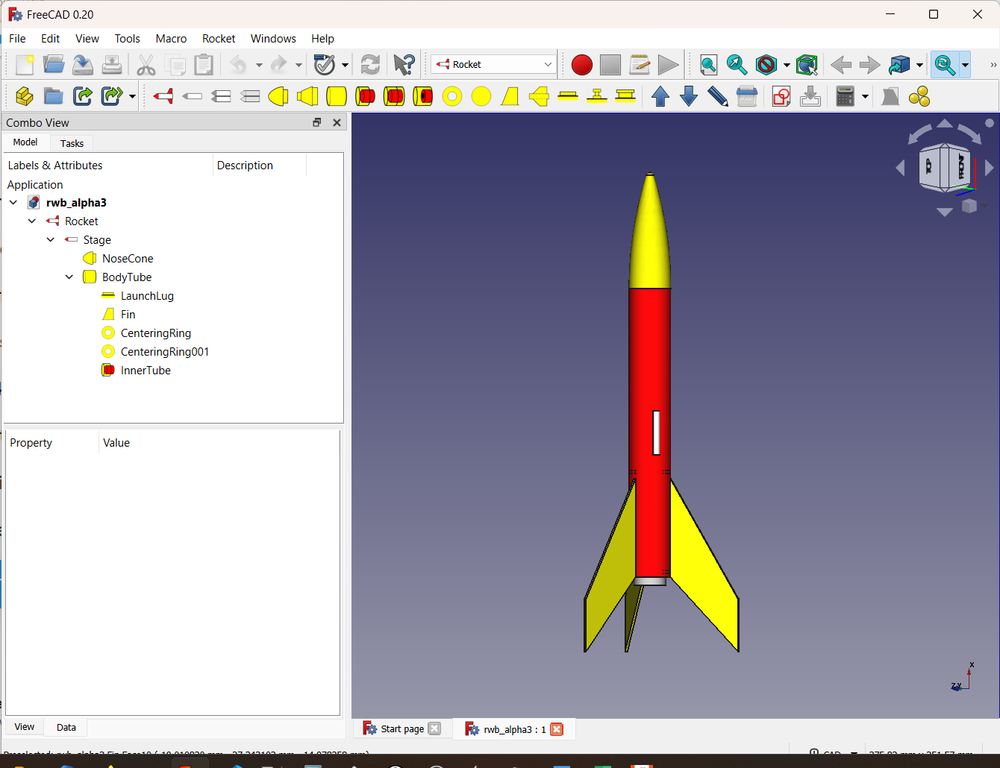

## FreeCAD Rocketry Workbench

A rocket design workbench for FreeCAD

## Requirements

The Rocket Workbench **REQUIRES FREECAD V1.0**

If you have an older version **DO NOT UPGRADE**

Due to limitations in the add on manager it will happily upgrade the workbench despite not being able to support it.
This results in the workbench installing, but not showing up in FreeCAD.

To use it with previous versions you can try this workaround. Follow the instructions on this page: https://github.com/davesrocketshop/Rocket/blob/master/TESTING.md
Select the branch "Tag v3.3.0".

## Install

The Rocket Workbench is available as part of the Addon Manager. See https://wiki.freecadweb.org/Std_AddonMgr

## Materials

As of version 1.0, FreeCAD has an extensive material system built in. This workbench uses that material system and for that reason requires v1.0 of the core product. Earlier versions of
the product will load earlier less capable versions of this workbench.

Materials are set automatically on import when available. The values chosen can be overridden by changing the material in the parts "Material" tab, or by right clicking on the part and
selection "Material...". The appearance can also be changed by right clicking on the part and selection "Appearance...". Both of these operations can be done from within the part tree
as well.

## Computational Fluid Dynamics

Version 4.0 and later supports a dedicated workflow for setting up Computational Fluid Dynamics (CFD) studies. This capability requires that you have the external workbench **CfdOF**
installed and properly configured.

## Internationalization

This workbench has been written with multiple language support. If you are willing to provide a translation to your native language please refer to [CONTRIBUTING.md](CONTRIBUTING.md) for information on how to get started.

## Reporting issues

The best method for reporting problems is to create a new issue in [GitHub](https://github.com/davesrocketshop/Rocket/issues). Please include information
such as the development branch you're using, instructions on how to reproduce the error, and where relevant a copy of the file in which the issue was encountered.
The more information you provide the easier it will be to pinpoint the problem.

## Feedback

For any feedback, features, and discussion please refer to the Rocketry workbench FreeCAD [forum thread](https://forum.freecadweb.org/viewtopic.php?f=8&t=54496).

## Developers

David Carter AKA [@davesrocketshop](https://github.com/davesrocketshop)

Your name here...

## Contributions

Component database originally taken from the Open Rocket project. (https://github.com/openrocket/openrocket) Whole sections of the Open Rocket code have been shamelessly plagiarized.

Now using the improved and curated parts database by Dave Cook instead (https://github.com/dbcook/openrocket-database)

Portions of the pyatmos module by Chunxiao Li are included with this software (https://github.com/lcx366/ATMOS)

Many features have been added based on user suggestions, and in some cases with the help of users with domain specific expertise.

## License
LGPLv2.1 (see [LICENSE](LICENSE))