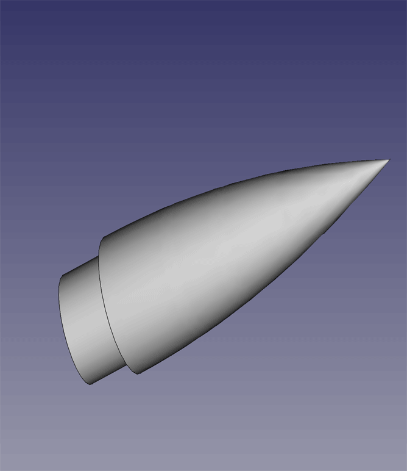

## FreeCAD Rocketry Workbench

A rocket design workbench for FreeCAD

## Install

### Automatic

TBD
  
### Manual

  
Expand for Manual install instructions

1. Obtain your user's default FreeCAD folder by typing the following in to the FreeCAD Python console `FreeCAD.ConfigGet("UserAppData")`
2. Open a shell terminal
3. Switch to folder in step 1 and append the `Mod/` subfolder ex: `cd ~/.FreeCAD/Mod`
4. Type `git clone https://github.com/davesrocketshop/Rocket`

The Rocket workbench will automagically download to your local machine. 

5. Restart FreeCAD for changes to take place.
6. Rocket WB should now be available in the workbench dropdown menu.

**Note:** In order to keep Rocket WB up-to-date you'll need to follow Steps 2 and 3. But for step 4 replace with `git pull`  
Again, restart FC to use the latest changes.

## Internationalization

This workbench has been written with multiple language support. If you are willing to provide a translation to your native language please open an issue and we'll work to get that done.

## Feedback

For any feedback, bugs, features, and discussion please refer to the Rocketry workbench FreeCAD [forum thread](https://forum.freecadweb.org/viewtopic.php?f=8&t=54496).

## Developers

David Carter AKA [@davesrocketshop](https://github.com/davesrocketshop)

## License
GPLv2.1 (see [LICENSE](LICENSE))