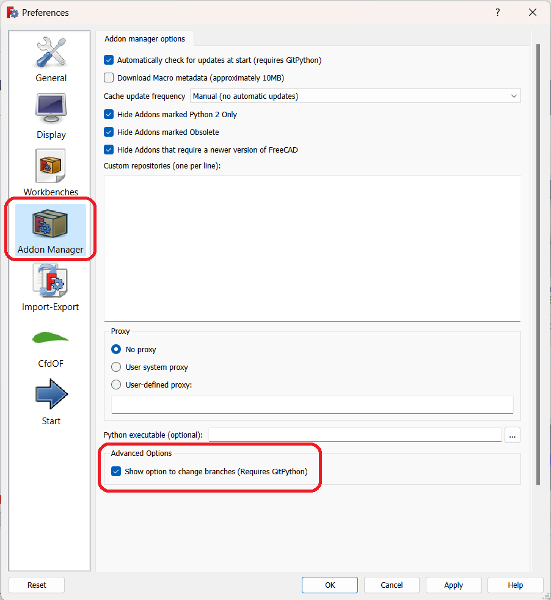
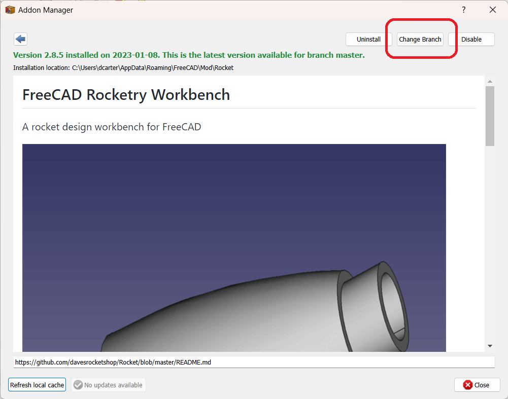

## FreeCAD Rocketry Workbench Test Branches

Test branches will be released periodically to allow users to try out new features and report any issues

## Install

**_You will need to have `git` installed._** This installs the GitPython required by the Addon manager. You can download `git` here: [https://git-scm.com/downloads](https://git-scm.com/downloads)

For non-developers, FreeCAD provides a mechanism for installing development versions using the Addon Manager. This option is not available by
default so you will need to enable it. From the `Edit` menu select `Preferences...`. In the left hand column select `Addon Manager`.

In the `Advanced Options` section check the `Show option to change branches` option. This will require a restart of FreeCAD to take effect.

Once restarted, select `Tools` and the `Addon manager` from the main menu. Scroll down to the `Rocket` workbench and select. In the installation menu you
will see the option `Change Branch`. Selecting this will bring up a list of branches allowing you to select the branch to test

### Testing

**_VERY IMPORTANT_**

*File formats in test branches may change and are typically not backwards compatible. If you open a file created with a previous version and save it
with the test version you may not be able to open it again. Make sure you save anything important before testing. Even files created during testing
may not be compatible with the final software version.*

## Reporting issues

The best method for reporting problems is to create a new issue in [GitHub](https://github.com/davesrocketshop/Rocket/issues). Please include information
such as the development branch you're using, instructions on how to reproduce the error, and where relevant a copy of the file in which the issue was encountered.
The more information you provide the easier it will be to pinpoint the problem.

## Feedback

For any feedback, features, and discussion please refer to the Rocketry workbench FreeCAD [forum thread](https://forum.freecadweb.org/viewtopic.php?f=8&t=54496).
